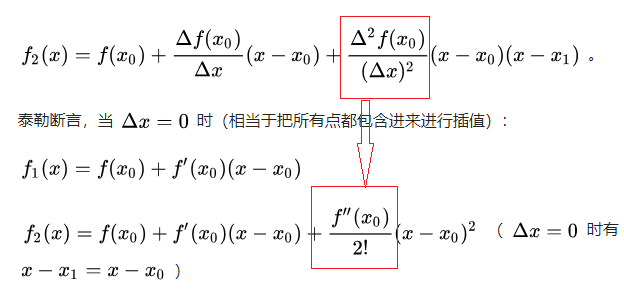
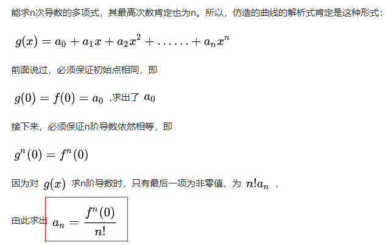

## 机器学习中的数学知识

这篇文章总体说明了机器学习中需要的数学知识，后续按照这个路径进行学习了

https://mp.weixin.qq.com/s/TGduc9OhX9ZeBJUPPj5uHg

导数和微分

**方向导数和梯度**

关于方向导数的证明，有两种形式：

1)利用*泰勒展开*

http://netedu.xauat.edu.cn/jpkc/netedu/jpkc/gdsx/homepage/5jxsd/51/513/5308/530807.htm

更多维的方向导数可以按照上面三维情形的泰勒展开依次推导得到

2）另外一种证明方式参考如下网址中的图片

https://www.jianshu.com/p/76197f128366

梯度下降

导数的链式法则

**泰勒展开**

https://zhuanlan.zhihu.com/p/27348707

上面这个链接对于泰勒展开做了一个粗略的证明，讲解了其和牛顿差值的关系，很有启发意义，但这里有一个二阶多项式的系数的求解不是很理解，作为遗留问题吧

另外一篇帖子讲到了如何求解这个多项式系数

https://www.zhihu.com/question/25627482/answer/313088784?utm_medium=social&utm_source=weibo

同时这篇帖子也讲解了，泰勒展开的误差问题，比较经典，可以细读一下

**梯度下降和泰勒展开的关系**

参考：https://zhuanlan.zhihu.com/p/82757193

**BP神经网络**

有机会自己手动推导下

## 机器学习实战

《游戏编程中的人工智能技术.pdf》

这本书中的例子准备采用如下几个阶段进行学习

1）看懂源代码，调整遗传算法或者神经网络输入层、隐层、输出层等相关参数，观察程序运行结果

2）利用源代码程序中的框架，完成书中课后习题相关程序的编写

3）完全重写复现书中代码的例子，实现所有源代码自己编写

4）利用神经网络完成俄罗斯方块等AI程序设计