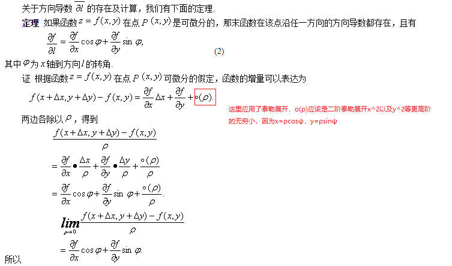
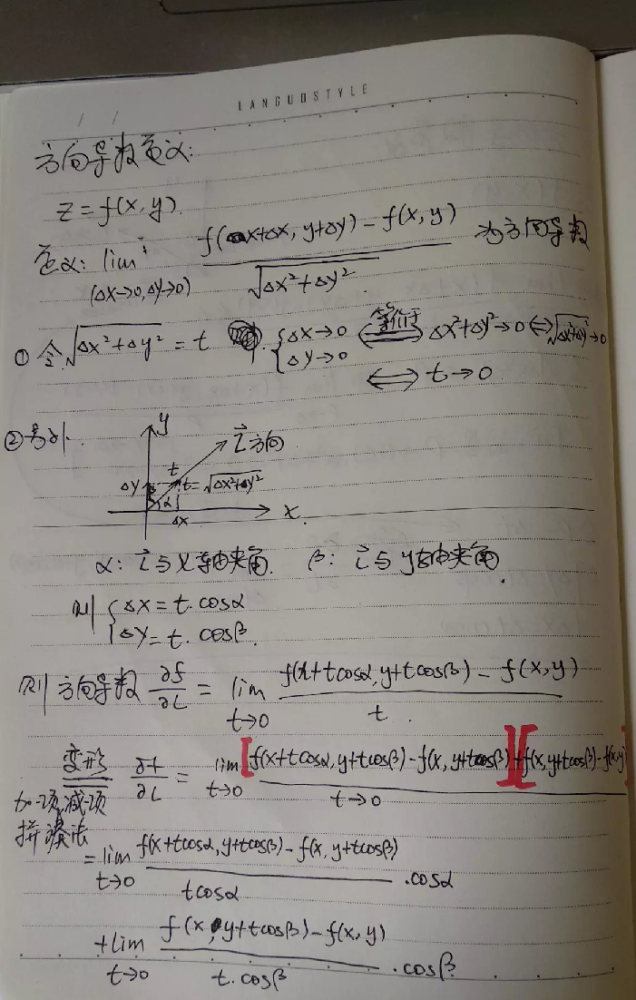
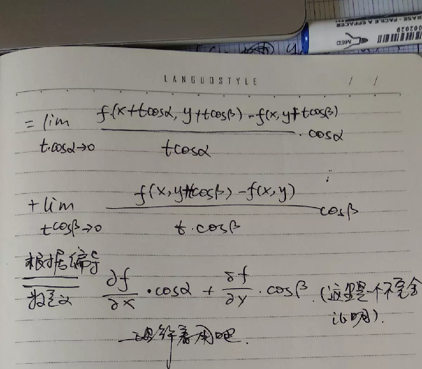

## 机器学习中的数学知识

导数和微分

**方向导数和梯度**

关于方向导数的证明，有两种形式：

1)利用*泰勒展开*

http://netedu.xauat.edu.cn/jpkc/netedu/jpkc/gdsx/homepage/5jxsd/51/513/5308/530807.htm

更多维的方向导数可以按照上面三维情形的泰勒展开依次推导得到

2）另外一种证明方式参考如下网址中的图片

https://www.jianshu.com/p/76197f128366

梯度下降

导数的链式法则

泰勒展开

梯度下降和泰勒展开的关系

BP神经网络